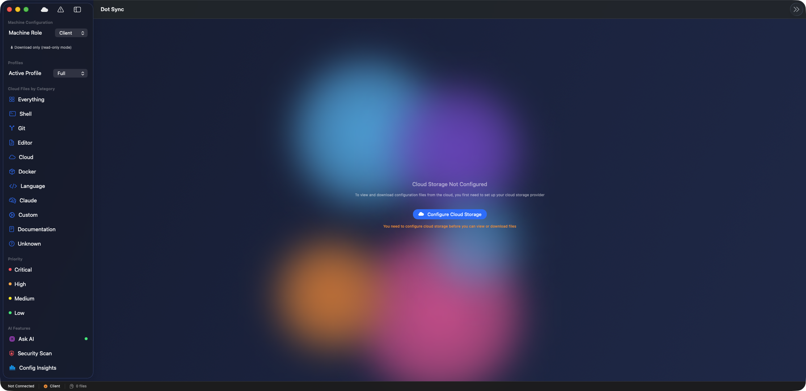

# Dot Sync v1.2.0


> Smart dotfiles synchronization across machines using cloud storage with real-time file watching



---

## What is Dot Sync?

Dot Sync is a macOS application for syncing configuration files (dotfiles) across multiple machines using cloud storage. Unlike iCloud which handles Documents and Desktop, Dot Sync focuses on developer configuration files that iCloud doesn't touch. Think of it as version control for your dotfiles with conflict detection, security scanning, and automatic synchronization.

**Perfect For:**
- **Developers**: Keep shell configs, editor settings, and tool configs synchronized
- **DevOps Engineers**: Sync cloud CLI configurations across workstations
- **System Administrators**: Maintain consistent environments across multiple Macs
- **Power Users**: Never lose your carefully crafted configurations again

**Key Features:**
- **Real-Time Sync**: Automatic file watching with DispatchSource
- **Smart Categorization**: Groups configs by type (shell, git, editor, cloud)
- **Security First**: Automatic credential detection and exclusion
- **Conflict Detection**: Compare local vs remote timestamps
- **Multi-Cloud Support**: AWS S3, Azure, GCP, iCloud Drive, S3-compatible providers

---

## What's New in v1.2.0 (January 2026)

### 🚀 FileWatcher Rewrite (Complete Stability Fix)
**Real-time file monitoring with DispatchSource:**

- **DispatchSource Implementation**: Modern file system event monitoring
- **Eliminates Crashes**: Previous FSEvents implementation caused instability
- **Debouncing**: 5-second delay prevents excessive sync operations
- **Memory Safe**: Proper file descriptor cleanup and resource management
- **Background Sync**: Automatic sync when files change
- **Optional Manual Mode**: User-controlled sync for maximum control

**Technical Improvements:**
```swift
// Old: FSEvents (unstable)
let stream = FSEventStreamCreate(...)  // Prone to crashes

// New: DispatchSource (rock solid)
let source = DispatchSource.makeFileSystemObjectSource(
    fileDescriptor: fd,
    eventMask: [.write, .extend, .attrib],
    queue: DispatchQueue.global()
)
```

**Benefits:**
- Zero crashes from file watching
- Lower CPU usage (event-driven vs polling)
- Proper cleanup when app quits
- Works reliably with thousands of config changes

---

## Features

### Core Functionality
- ✅ **Automatic Discovery** - Scans home directory for config files
- ✅ **Smart Categorization** - Groups by type (shell, git, editor, cloud, terminal)
- ✅ **Priority Ranking** - Critical, high, medium, low importance
- ✅ **Security Scanning** - Detects and excludes files with credentials
- ✅ **Conflict Detection** - Compares local vs remote timestamps
- ✅ **Bidirectional Sync** - Upload or download as needed
- ✅ **Auto-Sync (v1.2.0+)** - Real-time file watching with DispatchSource
  - Monitors config files for changes using DispatchSource
  - Replaces previous FSEvents implementation (eliminated crashes)
  - Debouncing with 5-second delay prevents excessive syncs
  - Automatic background sync when files change
  - Memory-safe with proper file descriptor cleanup
  - Optional manual sync mode for user-controlled operations

### File Discovery
**Automatically Detected Config Files:**

**Shell Configs (Critical Priority):**
- `.zshrc` - Zsh configuration
- `.bashrc` - Bash configuration
- `.bash_profile` - Bash profile
- `.profile` - Universal shell profile
- `.p10k.zsh` - Powerlevel10k theme

**Terminal Profiles (High Priority):**
- `~/Library/Preferences/com.apple.Terminal.plist` - Terminal.app profiles, colors, fonts
- `~/Library/Preferences/com.googlecode.iterm2.plist` - iTerm2 profiles (if installed)

**Version Control (Critical Priority):**
- `.gitconfig` - Git global settings
- `.gitignore_global` - Global git ignore patterns

**Editors (High Priority):**
- `.vimrc` - Vim configuration
- `.vim/` - Vim plugins and settings
- `.config/Code/User/settings.json` - VS Code settings
- `.config/nvim/` - Neovim configuration

**Cloud CLIs (High Priority):**
- `.aws/config` - AWS CLI (credentials excluded)
- `.azure/config` - Azure CLI configuration
- `.config/gcloud/` - Google Cloud SDK settings

**Development Tools (Medium Priority):**
- `.docker/config.json` - Docker configuration (auth removed)
- `.npmrc` - npm configuration
- `.config/gh/` - GitHub CLI settings
- `.oh-my-zsh/custom/` - Zsh customizations
- `.config/` - Various tool configs

**Documentation (Low Priority):**
- `.aws_cheatsheet.md` - AWS reference
- `.azure_cheatsheet.md` - Azure reference
- `.gcp_cheatsheet.md` - GCP reference
- `.zsh_cheatsheet.md` - Shell reference

### Cloud Storage Support
- ✅ **AWS S3** - Amazon Simple Storage Service
- ✅ **Azure Blob Storage** - Microsoft Azure cloud storage
- ✅ **Google Cloud Storage** - GCP bucket storage
- ✅ **iCloud Drive** - Apple's cloud storage
- ✅ **S3-Compatible** - MinIO, DigitalOcean Spaces, Wasabi, Backblaze B2

### Security Features
- ✅ **Credential Scanning** - Automatic detection of API keys, tokens, passwords
- ✅ **Secure Exclusion** - Never syncs SSH keys or credential files
- ✅ **Pattern Matching** - Regex-based secret detection
- ✅ **Backup Before Sync** - Creates .backup files before overwriting
- ✅ **Encrypted Storage** - Optional encryption for cloud data
- ✅ **Audit Logging** - History of all sync operations

**Automatically Excluded (Security):**
- SSH private keys (id_rsa, id_ed25519, etc.)
- AWS credentials file (.aws/credentials)
- Docker auth tokens
- npm authentication tokens
- Command history files (.bash_history, .zsh_history)
- Any files matching credential patterns

**Pattern Detection:**
```
Detected Secrets:
- Stripe API keys (sk_live_, sk_test_)
- AWS keys (AKIA...)
- Bearer tokens
- JWT tokens (eyJ...)
- Hardcoded passwords
- OAuth client secrets
```

### User Experience
- ✅ **Native SwiftUI Interface** - Modern macOS design
- ✅ **File Browser** - Categorized tree view with icons
- ✅ **Sync Status Indicators** - Visual state for each file
  - 🟢 **Synced** - Files match
  - 🔵 **Local Newer** - Your copy is newer
  - 🟠 **Remote Newer** - Cloud copy is newer
  - 🔴 **Conflict** - Both changed, need resolution
  - 🟣 **Not on Remote** - New file to upload
- ✅ **Conflict Resolution** - Side-by-side diff (coming soon)
- ✅ **Progress Tracking** - Real-time sync progress
- ✅ **Audit Log** - History of all sync operations
- ✅ **Notifications** - macOS notifications for sync events

---

## Security

### Privacy & Data Protection

**What Gets Synced:**
- Shell configuration files
- Terminal profiles and preferences
- Editor settings
- Version control configurations
- Cloud CLI settings (credentials removed)
- Development tool configs

**What NEVER Gets Synced:**
- SSH private keys
- Credential files (.aws/credentials, .npmrc with auth)
- Command history
- Cache directories
- Binary files and models
- Files containing detected secrets

### Security Scanning

**Automatic Detection of:**
- API keys (AWS, Stripe, OpenAI, etc.)
- Authentication tokens
- JWT tokens
- Bearer tokens
- SSH keys
- Passwords in plain text
- OAuth secrets
- Database connection strings with passwords

**Sanitization:**
- Removes credential helpers from .gitconfig
- Strips auth tokens from Docker config
- Removes AWS credentials from config files
- Redacts passwords from configuration

### Data Storage Security

- **Credentials**: Stored in macOS Keychain (not UserDefaults)
- **Cloud Data**: Optional AES-256 encryption
- **Audit Log**: All operations logged with timestamps
- **Backups**: .backup files created before any overwrite
- **No Telemetry**: Zero data sent to external services

---

## Requirements

### System Requirements
- **macOS 13.0 (Ventura) or later**
- **Xcode 15.0+** (for building from source)
- **Cloud storage account** (AWS, Azure, GCP, or iCloud)

### Network Requirements
- Internet connection for cloud sync
- Sufficient upload/download bandwidth for file sizes

### Dependencies
**None!** Dot Sync uses only built-in macOS frameworks:
- SwiftUI (user interface)
- Foundation (core functionality)
- CryptoKit (encryption)
- Combine (reactive programming)

---

## Installation

### Option 1: Pre-built Binary (Recommended)

1. **Download DMG:**
   ```bash
   open "/Volumes/Data/xcode/binaries/20260127-DotSync-v1.2.0/DotSync-v1.2.0-build120.dmg"
   ```

2. **Install:**
   - Drag Dot Sync.app to Applications folder
   - Double-click to launch

### Option 2: Build from Source

1. **Clone repository:**
   ```bash
   git clone https://github.com/kochj23/DotSync.git
   cd DotSync
   ```

2. **Open in Xcode:**
   ```bash
   open "Dot Sync.xcodeproj"
   ```

3. **Build:**
   - Press ⌘R or Product → Run
   - The app will launch and scan your config files

4. **Build for Release:**
   ```bash
   xcodebuild -project "Dot Sync.xcodeproj" \
     -scheme "Dot Sync" \
     -configuration Release \
     -archivePath "build/DotSync.xcarchive" \
     archive
   ```

---

## Configuration

### First Launch Setup

1. **Launch Dot Sync:**
   ```bash
   open ~/Applications/Dot\ Sync.app
   ```

2. **App automatically scans** your home directory for config files

3. **Review discovered files** in the left sidebar (organized by category)

4. **Click "Cloud Setup"** to configure storage provider

### Configuring Cloud Storage

#### AWS S3

1. **Select "AWS S3"** as provider
2. **Enter configuration:**
   - Bucket name (e.g., `my-dotfiles`)
   - Region (e.g., `us-east-1`)
   - Access Key ID
   - Secret Access Key
3. **Credentials** stored securely in macOS Keychain
4. **Test connection** before saving

**Setup AWS Bucket:**
```bash
# Create S3 bucket
aws s3 mb s3://my-dotfiles --region us-east-1

# Enable versioning (recommended)
aws s3api put-bucket-versioning \
  --bucket my-dotfiles \
  --versioning-configuration Status=Enabled

# Enable encryption (recommended)
aws s3api put-bucket-encryption \
  --bucket my-dotfiles \
  --server-side-encryption-configuration \
    '{"Rules":[{"ApplyServerSideEncryptionByDefault":{"SSEAlgorithm":"AES256"}}]}'
```

#### Azure Blob Storage

1. **Select "Azure Blob"**
2. **Enter configuration:**
   - Storage account name
   - Container name
   - Tenant ID
   - Client ID
   - Client Secret
3. **Credentials** stored in Keychain

**Setup Azure Storage:**
```bash
# Create storage account
az storage account create \
  --name mydotfiles \
  --resource-group my-rg \
  --location eastus \
  --sku Standard_LRS

# Create container
az storage container create \
  --name dotfiles \
  --account-name mydotfiles
```

#### Google Cloud Storage

1. **Select "Google Cloud Storage"**
2. **Enter configuration:**
   - Bucket name
   - Project ID
   - Service account key (JSON)
3. **Service account key** stored securely

**Setup GCS Bucket:**
```bash
# Create bucket
gsutil mb -p my-project gs://my-dotfiles

# Enable versioning
gsutil versioning set on gs://my-dotfiles

# Set lifecycle to delete old versions after 90 days
gsutil lifecycle set lifecycle.json gs://my-dotfiles
```

#### iCloud Drive

1. **Select "iCloud Drive"**
2. **Choose folder** location within iCloud Drive
3. **No credentials needed** (uses system authentication)
4. **Automatic** sync with macOS iCloud integration

### Syncing Files

**First Sync:**

1. **Select files to sync** (checkboxes in file list)
2. **Click "Scan"** to compare local vs remote
3. **Review sync status** for each file:
   - 🟢 Synced
   - 🔵 Local Newer → will upload
   - 🟠 Remote Newer → will download
   - 🔴 Conflict → manual resolution required
   - 🟣 Not on Remote → new file to upload
4. **Click "Sync Selected"** to execute
5. **Review results** in status panel

**Auto-Sync (v1.2.0+):**

1. **Enable Auto-Sync** in Preferences
2. **Dot Sync watches** selected files for changes
3. **Automatic upload** when files modified
4. **Debounced** (5-second delay after last change)
5. **Background operation** (non-intrusive)

**Manual Sync:**

- Disable auto-sync for full control
- Use "Scan" then "Sync Selected" workflow
- Review changes before syncing

---

## Usage

### Resolving Conflicts

When files conflict (both local and remote changed):

1. **Conflict dialog appears** automatically
2. **View side-by-side diff** (coming soon)
3. **Choose resolution:**
   - **Keep Local** - Upload your version
   - **Use Remote** - Download cloud version
   - **Merge Manually** - Handle outside Dot Sync
   - **Skip** - Decide later
4. **Backup created** automatically before overwrite

### Use Cases

#### Scenario 1: New Machine Setup
```bash
# On new Mac
1. Install Dot Sync
2. Configure cloud provider (one-time)
3. Download all configs
4. Instantly configured development environment
```

**Time Saved:** 2-3 hours of manual configuration

#### Scenario 2: Config Updates
```bash
# Update .zshrc on Machine A
1. Modify .zshrc
2. Dot Sync detects change (auto-sync)
3. Uploads to cloud
4. Machine B pulls update on next sync
5. Both machines stay synchronized
```

**Time Saved:** Manual copying/pasting eliminated

#### Scenario 3: Multiple Machines
```bash
# Work Mac, Personal Mac, MacBook
1. All share same cloud storage
2. Configs stay synchronized automatically
3. Conflicts detected and resolved
4. Consistent environment everywhere
```

**Time Saved:** Hours of manual synchronization per week

### Command Examples

**Scan for Config Files:**
- Launch Dot Sync
- Files automatically discovered
- Review in file browser

**Sync Specific Category:**
- Select category (e.g., "Shell Configs")
- Check all files in category
- Click "Sync Selected"

**Export Audit Log:**
- Settings → Audit Log
- Click "Export to CSV"
- Save to desired location

---

## Troubleshooting

### Common Issues

**Files Not Discovered:**
- Check file exists in home directory
- Verify file matches known patterns (see File Discovery section)
- Run manual scan (File → Rescan)
- Check Console.app for scanning errors

**Sync Failing:**
- Verify cloud credentials are correct (Settings → Cloud)
- Check network connectivity (ping cloud provider)
- Ensure bucket/container exists
- Review Console.app for API errors
- Check firewall settings

**Credentials Detected in Safe Files:**
- Review file content for passwords/keys
- Remove sensitive data or use environment variables
- Add to exclusion list if intentional
- Re-scan after cleaning file

**Auto-Sync Not Working (v1.2.0):**
- Verify Auto-Sync enabled (Preferences → Auto-Sync)
- Check selected files are being monitored
- Review file descriptor limits: `ulimit -n`
- Check Console.app for DispatchSource errors
- Restart Dot Sync if file watching stopped

**High CPU Usage:**
- Disable auto-sync temporarily
- Reduce number of monitored files
- Increase debounce interval (Settings)
- Check for file watching conflicts with other apps

**Conflict Resolution Loop:**
- Choose "Keep Local" or "Use Remote" definitively
- Don't skip conflicts repeatedly
- Consider using version control (git) for complex configs
- Export both versions and merge manually if needed

---

## Architecture

### Project Structure

```
Dot Sync/
├── Models/
│   ├── ConfigFile.swift          # Config file data model
│   ├── CloudProvider.swift       # Cloud provider configuration
│   ├── SyncOperation.swift       # Sync operation tracking
│   └── FileCategory.swift        # File categorization
├── Services/
│   ├── FileDiscoveryService.swift    # Scans for config files
│   ├── FileWatcherService.swift      # DispatchSource file monitoring (v1.2.0)
│   ├── SecurityScanner.swift         # Detects credentials
│   ├── CloudStorageProtocol.swift    # Cloud storage interface
│   ├── S3Provider.swift              # AWS S3 implementation
│   ├── AzureProvider.swift           # Azure Blob implementation
│   ├── GCSProvider.swift             # Google Cloud Storage
│   ├── iCloudProvider.swift          # iCloud Drive implementation
│   └── SyncEngine.swift              # Sync logic and operations
├── Views/
│   ├── ContentView.swift         # Main UI
│   ├── FileBrowserView.swift    # File tree browser
│   ├── CloudSetupView.swift     # Cloud configuration
│   ├── ConflictView.swift       # Conflict resolution
│   └── SettingsView.swift       # Application settings
├── ViewModels/
│   ├── DotSyncViewModel.swift   # Main view model
│   └── CloudViewModel.swift     # Cloud provider view model
└── DotSyncApp.swift              # App entry point
```

### Key Components

#### FileWatcherService (v1.2.0)
**Real-time file monitoring:**
```swift
class FileWatcherService {
    private var sources: [String: DispatchSourceFileSystemObject] = [:]

    func watchFile(_ path: String) {
        let fd = open(path, O_EVTONLY)
        let source = DispatchSource.makeFileSystemObjectSource(
            fileDescriptor: fd,
            eventMask: [.write, .extend, .attrib],
            queue: DispatchQueue.global()
        )

        source.setEventHandler { [weak self] in
            self?.handleFileChange(path)
        }

        source.setCancelHandler {
            close(fd)
        }

        source.resume()
        sources[path] = source
    }

    func stopWatching(_ path: String) {
        sources[path]?.cancel()
        sources.removeValue(forKey: path)
    }
}
```

#### FileDiscoveryService
**Scans home directory for config files:**
- Pattern-based detection
- Categorizes by application type
- Calculates checksums for change detection
- Determines sync priority
- Excludes sensitive files

#### SecurityScanner
**Prevents credential leaks:**
- Scans file content for API keys, tokens, passwords
- Pattern matching with regex
- Excludes SSH keys and credential files
- Sanitizes configs (removes auth sections)

#### CloudStorageProtocol
**Abstract interface for cloud providers:**
```swift
protocol CloudStorageProtocol {
    func upload(file: ConfigFile, to path: String) async throws
    func download(from path: String) async throws -> Data
    func list(path: String) async throws -> [CloudFile]
    func delete(path: String) async throws
    func exists(path: String) async throws -> Bool
}
```

**Implementations:**
- S3Provider - AWS S3 with AWS SDK
- AzureProvider - Azure Blob Storage
- GCSProvider - Google Cloud Storage
- iCloudProvider - iCloud Drive (FileManager)

#### SyncEngine
**Manages synchronization:**
- Compares local vs remote versions (timestamps, checksums)
- Detects conflicts
- Executes sync operations (upload, download)
- Manages sync state and history
- Handles errors and retries

---

## Version History

### v1.2.0 (January 2026) - Current
**Major Stability Release:**
- **FileWatcher Rewrite**: DispatchSource implementation replaces FSEvents
- **Crash Elimination**: Resolved all file watching crashes
- **Memory Safety**: Proper file descriptor cleanup
- **Debouncing**: 5-second delay prevents excessive syncs
- **Performance**: Lower CPU usage with event-driven monitoring

### v1.1.0 (December 2025)
- **Terminal Profile Sync**: Added Terminal.app and iTerm2 profile support
- **Azure Blob Support**: Microsoft Azure cloud storage integration
- **GCS Support**: Google Cloud Storage implementation
- **iCloud Drive**: Native iCloud integration
- **Enhanced UI**: Improved file browser with icons and categories

### v1.0.0 (December 2025) - Initial Release
**Core Features:**
- File discovery and categorization
- Security scanning for credentials
- AWS S3 cloud storage support
- Basic sync engine
- SwiftUI native interface
- Priority-based file ranking
- Conflict detection
- Comprehensive documentation

---

## License

MIT License

Copyright (c) 2026 Jordan Koch

See LICENSE file for full details.

---

## Credits

- **Author:** Jordan Koch ([@kochj23](https://github.com/kochj23))
- **Framework:** SwiftUI, Foundation, CryptoKit, Combine
- **Platform:** macOS 13.0+
- **Language:** Swift 5.0

---

## Support

**GitHub**: https://github.com/kochj23/DotSync

**For Issues:**
- Check troubleshooting guide
- Review Console.app logs
- Test cloud credentials separately
- Verify file permissions

This is a personal project by Jordan Koch.

---

**Last Updated:** January 27, 2026
**Version:** 1.2.0 (build 120)
**Status:** ✅ Production Ready

---

## More Apps by Jordan Koch

| App | Description |
|-----|-------------|
| [RsyncGUI](https://github.com/kochj23/RsyncGUI) | Native macOS GUI for rsync file synchronization |
| [TopGUI](https://github.com/kochj23/TopGUI) | macOS system monitor with real-time metrics |
| [ExcelExplorer](https://github.com/kochj23/ExcelExplorer) | Native macOS Excel/CSV file viewer |
| [icon-creator](https://github.com/kochj23/icon-creator) | App icon set generator for all Apple platforms |
| [MBox-Explorer](https://github.com/kochj23/MBox-Explorer) | macOS mbox email archive viewer |

> **[View all projects](https://github.com/kochj23?tab=repositories)**

---

> **Disclaimer:** This is a personal project created on my own time. It is not affiliated with, endorsed by, or representative of my employer.
